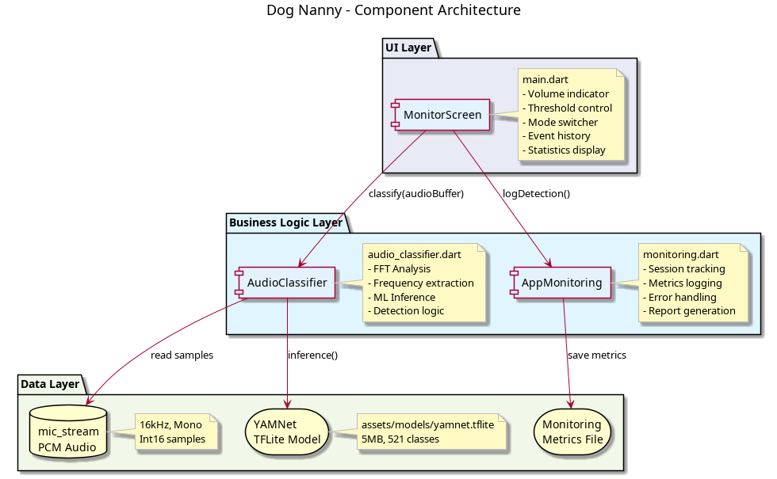
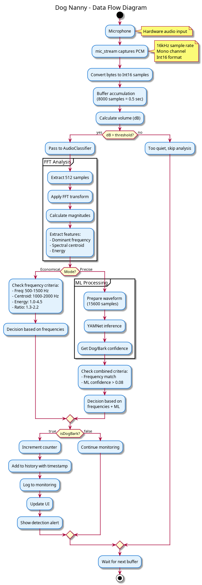
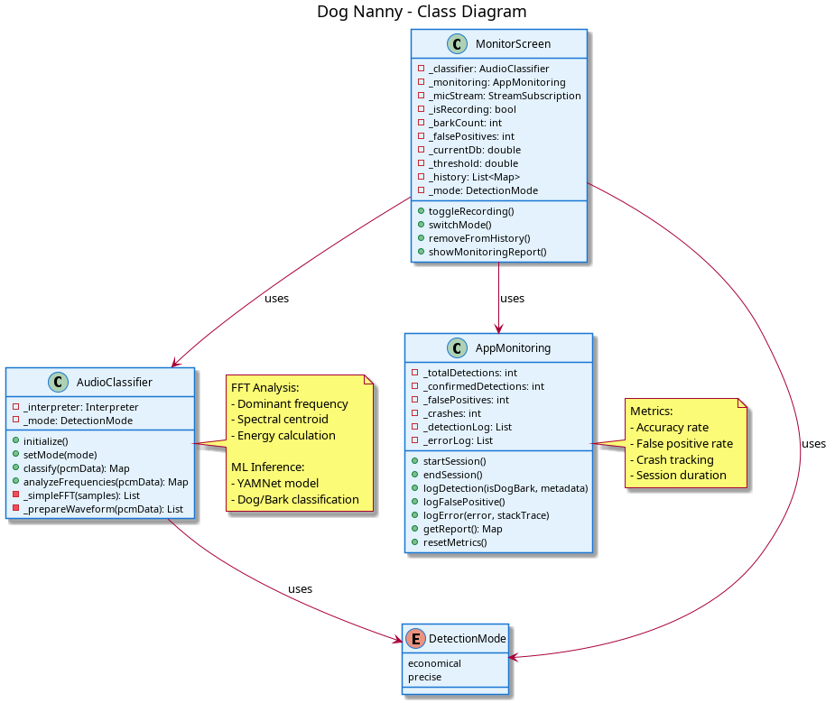

# Dog Nanny - Мобильное приложение для мониторинга лая собак

Это приложение на Android, которое в реальном времени слушает звуки через микрофон и определяет, лает ли собака поблизости. Оно использует машинное обучение и частотный анализ, чтобы отличать настоящий лай от шума, шагов или других звуков.
Приложение захватывает аудио с микрофона Android, преобразует звук в спектрограмму (график частот по времени) и анализирует его с помощью модели TensorFlow Lite — лёгкой версии машинного обучения для мобильных. Алгоритмы проверяют ключевые признаки лая: частоты 200–8000 Гц, резкие всплески и ритм, типичные для собак. Обработка идёт мгновенно, без интернета, на процессоре телефона.
---

## Описание

Dog Nanny отслеживает звуки в реальном времени и определяет лай собаки с помощью двух методов:
- Частотный анализ при помощи быстрого преобразования Фурье (доминантная частота, спектральный центроид, энергия)
- Машинного обучения YAMNet (TensorFlow Lite)

Приложение предоставляет два режима детекции:
- Экономный режим - только частотный анализ, низкое энергопотребление
- Точный режим - ML, минимум ложных срабатываний

---

## Архитектура

Приложение построено по трёхуровневой архитектуре:

### UI Layer (main.dart)
- Интерфейс мониторинга с индикатором громкости
- Управление порогом детекции и переключение режимов
- История обнаруженных событий с возможностью удаления
- Статистика: подтверждённые лаи, ложные срабатывания, точность

### Business Logic Layer (audio_classifier.dart)
- FFT преобразования аудиосигнала (512 samples)
- Извлечение частотных признаков
- ML классификация через YAMNet (классы Dog/Bark)
- Метод анализа звукового сигнала на основе режима

### Data Layer
- Захват PCM аудио через mic_stream (16kHz mono)
- Загрузка и inference TFLite модели YAMNet (~5MB)

### Компонентная диаграмма



### Поток данных



### Диаграмма классов



Исходные PlantUML файлы: `docs/puml/

---

## Режимы детекции

### Режим "Частоты" (Economical)
Использует только FFT анализ:
- Доминантная частота: 500-1500 Гц
- Спектральный центроид: 1000-2000 Гц
- Энергия сигнала: 1.0-4.5
- Frequency Ratio: 1.3-2.2

### Режим "ML+Частоты" (Precise)
ML:
- YAMNet confidence >0.08 для классов связанных с собаками

---

## Метрики качества

### Performance
- Latency анализа: ~200-300ms
- Sample rate: 16kHz mono
- FFT size: 512 samples
- ML inference time: ~100ms

### Accuracy
Пользователь может удалять ложные срабатывания из истории.
Приложение автоматически рассчитывает:
- Подтверждённых лаев
- Ложных срабатываний (удалённых)
- Точность детекции в процентах

---

## Технологический стек

Framework: Flutter 3.5.3, Dart 3.5.3

Библиотеки:
- mic_stream: 0.7.2 - захват PCM аудио
- tflite_flutter: 0.11.0 - ML inference
- permission_handler: 11.4.0 - разрешения микрофона

ML Model: YAMNet (TensorFlow Lite, 521 класс, 5MB)

Platform: Android (minSdk 24, targetSdk 35, Java 17)

---

## Структура проекта

```
dog_nanny/
├── lib/
│ ├── main.dart # UI + мониторинг + статистика
│ ├── audio_classifier.dart # FFT анализ + ML классификация
│ └── monitoring.dart # Система мониторинга метрик
│
├── assets/
│ └── models/
│ └── yamnet.tflite # ML модель YAMNet (5MB, 521 класс)
│
├── android/
│ ├── app/
│ │ ├── build.gradle # Конфигурация сборки (Java 17, minSdk 24)
│ │ └── proguard-rules.pro # Правила обфускации для TFLite
│ └── gradle.properties # Gradle настройки
│
├── docs/
│ ├── architecture.puml/png # Компонентная диаграмма
│ ├── data_flow.puml/png # Диаграмма потока данных
│ ├── classes.puml/png # Диаграмма классов
│ ├── TESTING.md # Документация тестирования (19 кейсов)
│ └── MONITORING.md # Документация мониторинга
│
├── pubspec.yaml # Зависимости Flutter (mic_stream, tflite, etc)
└── README.md # Основная документация
```

---

## Сборка и установка

### Разработка (debug)

flutter run -d <device_id>

### Релиз (APK)

flutter build apk --release --split-per-abi

Результат:
- build/app/outputs/apk/release/app-arm64-v8a-release.apk (64-bit, ~20MB)
- build/app/outputs/apk/release/app-armeabi-v7a-release.apk (32-bit, ~18MB)

---

## Quality Assurance

### Testing Model
- Functional Testing: детекция лая, фильтрация музыки/речи/шума
- Usability Testing: пользовательская оценка через удаление ложных
- Performance Testing: измерение latency обработки

### User Feedback Mechanism
Каждое обнаруженное событие сохраняется в истории с временем и кнопкой удаления.
Удаление записи:
- Уменьшает счётчик подтверждённых лаев
- Увеличивает счётчик ложных срабатываний
- Пересчитывает метрику точности


